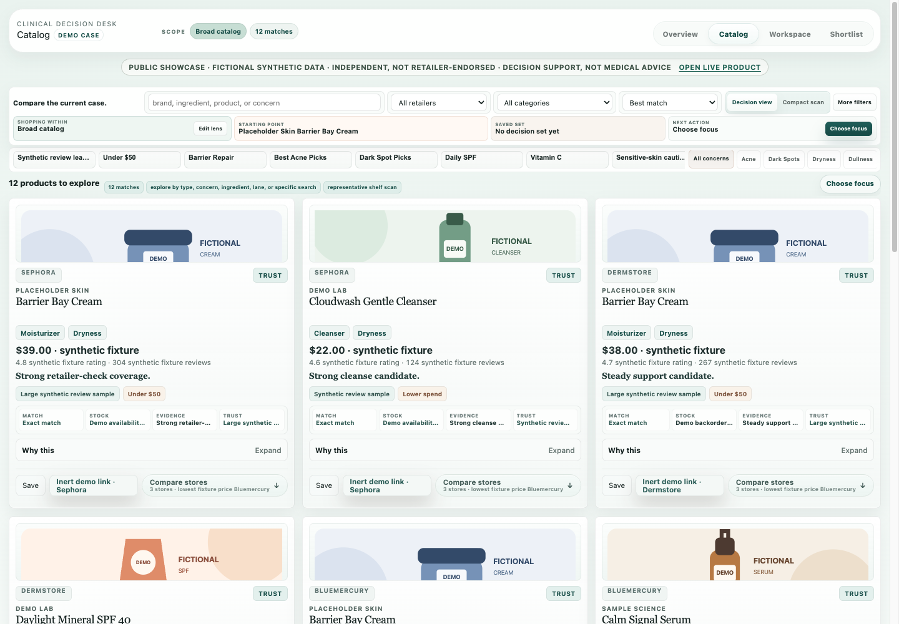
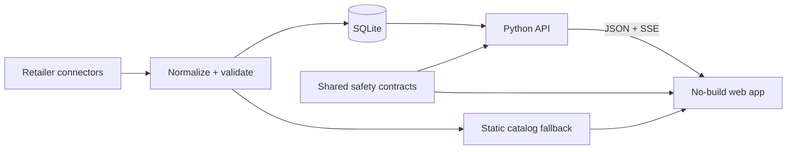

# Skincare Decision Hub

[](https://github.com/aancha/skincare-decision-hub/actions/workflows/ci.yml)

A skincare decision-support product combining **GPT-grounded explanations**, **MCP product tools**, and **evaluated learning-to-rank**—with deterministic safety and ranking authority. This public checkout uses synthetic data.

[**Open the live product**](https://skincarehub.app/) · [3-minute AI replay and walkthrough](docs/portfolio/demo-walkthrough.md) · [Architecture](docs/architecture/overview.md) · [Responsible-ML case study](docs/portfolio/responsible-ml.md)

Designed, built, tested, and operated end to end by **Aanchal**. Stack: Python, SQLite, server-sent events, and browser-native HTML/CSS/JavaScript—no frontend build step.

> Public-showcase data is synthetic. The live product is independent and is not affiliated with or endorsed by Sephora, Bluemercury, or Dermstore.



## The product

Skincare shopping often starts with hundreds of products and ends with unresolved questions: Which option fits the concern? What is the tradeoff? Is the routine too active-heavy? Is a cheaper retailer offer truly the same product?

SkinCare Hub turns that ambiguity into a four-step decision flow:

**Overview → Catalog → Shortlist → Routine**

- **Overview** starts a case from a concern, budget, ingredient, or retailer.
- **Catalog** ranks eligible products and explains the lead, evidence, and catch.
- **Shortlist** makes champion, backup, hold, and cut decisions explicit.
- **Routine**, inside Workspace, checks order, budget, and ingredient conflicts before purchase.

This is decision support, not medical advice. Red-flag symptoms, pregnancy or breastfeeding questions, prescriptions, allergies, and severe irritation are routed to appropriately cautious guidance.

## Proof at a glance

| Signal | Evidence status |
|---|---|
| Working product | **Publicly checkable:** [skincarehub.app](https://skincarehub.app/) and the synthetic local quick start |
| Data engineering | **Documented private evidence:** three connectors normalized 8,762 products in a dated September 4, 2026 snapshot |
| Live architecture | **Partly public:** the static client and SSE contract are inspectable; the Python/SQLite service stays private |
| Safety | **Publicly reproducible in Python and browser JavaScript:** the same deterministic 50-case fixture checks required product-posture, shopper-question, and routine-warning contracts in both runtimes |
| GPT application engineering | **Implementation inspected privately:** Shortlist, retailer comparison, routine rationale, and Learn use bounded context, structured output, citation checks and deterministic fallbacks; real-model quality is not established by offline tests |
| MCP integration | **Implementation inspected privately:** tools expose product capabilities to a client; tool execution is distinct from GPT explanation generation and is not evidence of autonomous-agent behavior |
| Responsible ML | **Public aggregate evidence:** learned rankers missed promotion gates, so deterministic ranking retained authority; private labels/models are excluded |
| Verification | **Published AI portfolio:** [PR #1](https://github.com/aancha/skincare-decision-hub/pull/1) merged with passing CI; a fresh anonymous main clone passed 24 tests, 50 guardrail cases and 25 syntax checks. See the [evidence guide](docs/portfolio/evidence.md) for scope and deferred checks |

## Three AI engineering stories

- **GPT explains decisions:** the application assembles product context before calling a model, validates structured responses and citation identifiers, and provides a deterministic fallback when context or provider output is unusable. Citation validation is not proof that every claim is supported.
- **MCP exposes bounded tools:** discovery and invocation connect a client to product capabilities. Protocol compatibility, enforced access restrictions, hosted operation, and actual ChatGPT invocation are separate things to verify.
- **Learning-to-rank tests a hypothesis:** a trained model was compared against a baseline and withheld from authoritative ranking when promotion criteria failed. GPT does not supply the learned ranker's scores.

The live application, this static synthetic checkout, and recorded demonstrations are separate evidence surfaces. The static website does not contact a model or private MCP service. Try the [offline GPT pipeline](examples/shortlist_ai/README.md), [real local MCP exchange](examples/mcp/README.md), or [paired evaluation harness](examples/evaluation/README.md). These examples are published and offline-tested; live-provider measurements and unfamiliar-human validation remain pending. Historical release tag `portfolio-2026-09` is unchanged.

## Architecture



The public showcase uses a small fictional fixture. Retailer-derived catalogs, images, descriptions, reviews, operational state, and private infrastructure are deliberately excluded.

## Three consequential decisions

1. **Keep the client static.** Native ES modules and a static fallback make the core catalog usable without Node, a bundler, credentials, or a running API.
2. **Treat safety as a contract.** Python and plain JavaScript share taxonomy and deterministic evaluation cases so sensitive guidance does not depend on unbounded model prose.
3. **Make live data additive.** SQLite and SSE improve freshness when the API is present; the product keeps a bounded fallback and avoids interrupting an active shopper decision.

## Responsible ML: the no-ship decision

Learned approaches were evaluated against explicit deterministic baselines. The final residual-slice experiment missed five required promotion gates, including the predeclared improvement threshold. The deterministic system therefore retained ranking authority.

A later interview-only comparison remained default-off, hash-verified, bounded to an already eligible top-five set, and non-authoritative. It did not silently turn SkinCare Hub into a production ML recommender. Inspect the [live comparison entry point](https://skincarehub.app/catalog/?mlDemo=1) with the [scenario and limitations](docs/portfolio/responsible-ml.md); an ineligible scenario can legitimately show deterministic fallback. Separately, [reproduce synthetic training and browser parity](examples/ml_ranking/README.md): this measures teacher imitation, not real recommendation quality.

## Run locally

Requires Python 3.9+; no credentials, crawler, OpenAI call, notification service, or persistent user data is needed.

```bash
python3 -m http.server 8000 --bind 127.0.0.1
```

Open [http://127.0.0.1:8000/web/](http://127.0.0.1:8000/web/), then stop the server with `Ctrl-C`.

The page loads this checkout's fictional `data/generated/catalog.json` from the repository root. No private operational catalog is needed or included.

## Limitations

- SkinCare Hub supports decisions; it does not diagnose or replace a clinician.
- It has no official retailer partnership or endorsement.
- Retailer price, availability, and content can become stale between refreshes.
- ML has no production ranking authority.
- External-user validation remains limited; fresh-context agent evaluation is reported separately, and unfamiliar-human validation is pending.
- The MIT License covers confirmed-original code, documentation, fictional synthetic data, and original synthetic assets in this repository. Retailer-derived and third-party material remains excluded as described in [NOTICE.md](NOTICE.md).

## Inspect next

- [Recruiter case study](docs/portfolio/case-study.md)
- [Evidence and reproducibility](docs/portfolio/evidence.md)
- [Current architecture](docs/architecture/overview.md)
- [Responsible-ML case study](docs/portfolio/responsible-ml.md)
- [Documentation by audience](docs/README.md)
