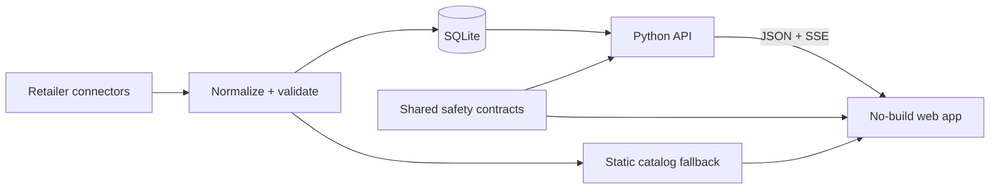

# Skincare Decision Hub

[](https://github.com/aancha/skincare-decision-hub/actions/workflows/ci.yml)

A privacy-safe skincare comparison and decision-support experience featuring synthetic product data, explainable recommendations, routine planning, and conservative safety guardrails.

[**Open the live product**](https://skincarehub.app/) · [2-minute text walkthrough](docs/portfolio/demo-walkthrough.md) · [Architecture](docs/architecture/overview.md) · [Responsible-ML case study](docs/portfolio/responsible-ml.md)

Designed, built, tested, and operated end to end by **Aanchal**. Stack: Python, SQLite, server-sent events, and browser-native HTML/CSS/JavaScript—no frontend build step.

> Public-showcase data is synthetic. The live product is independent and is not affiliated with or endorsed by Sephora, Bluemercury, or Dermstore.


## The product

Skincare shopping often starts with hundreds of products and ends with unresolved questions: Which option fits the concern? What is the tradeoff? Is the routine too active-heavy? Is a cheaper retailer offer truly the same product?

SkinCare Hub turns that ambiguity into a four-step decision flow:

**Overview → Catalog → Shortlist → Routine**

- **Overview** starts a case from a concern, budget, ingredient, or retailer.
- **Catalog** ranks eligible products and explains the lead, evidence, and catch.
- **Shortlist** makes champion, backup, hold, and cut decisions explicit.
- **Routine**, inside Workspace, checks order, budget, and ingredient conflicts before purchase.

This is decision support, not medical advice. Red-flag symptoms, pregnancy or breastfeeding questions, prescriptions, allergies, and severe irritation are routed to appropriately cautious guidance.

## Proof at a glance

| Signal | Evidence status |
|---|---|
| Working product | **Publicly checkable:** [skincarehub.app](https://skincarehub.app/) and the synthetic local quick start |
| Data engineering | **Documented private evidence:** three connectors normalized 8,762 products in a dated September 4, 2026 snapshot |
| Live architecture | **Partly public:** the static client and SSE contract are inspectable; the Python/SQLite service stays private |
| Safety | **Publicly reproducible in Python and browser JavaScript:** the same deterministic 50-case fixture checks required product-posture, shopper-question, and routine-warning contracts in both runtimes |
| Responsible ML | **Public aggregate evidence:** learned rankers missed promotion gates, so deterministic ranking retained authority; private labels/models are excluded |
| Verification | **Prepared public CI; local release-candidate status as of September 4, 2026 is 18/18:** front-door, link, manifest, quick-start, desktop/mobile browser flow, synthetic-data, 50-case Python/browser safety, and Python syntax checks pass |

## Architecture



The public showcase uses a small fictional fixture. Retailer-derived catalogs, images, descriptions, reviews, operational state, and private infrastructure are deliberately excluded.

## Three consequential decisions

1. **Keep the client static.** Native ES modules and a static fallback make the core catalog usable without Node, a bundler, credentials, or a running API.
2. **Treat safety as a contract.** Python and plain JavaScript share taxonomy and deterministic evaluation cases so sensitive guidance does not depend on unbounded model prose.
3. **Make live data additive.** SQLite and SSE improve freshness when the API is present; the product keeps a bounded fallback and avoids interrupting an active shopper decision.

## Responsible ML: the no-ship decision

Learned approaches were evaluated against explicit deterministic baselines. The final residual-slice experiment missed five required promotion gates, including the predeclared improvement threshold. The deterministic system therefore retained ranking authority.

A later interview-only comparison remained default-off, hash-verified, bounded to an already eligible top-five set, and non-authoritative. It did not silently turn SkinCare Hub into a production ML recommender. That refusal to promote an underqualified model is the strongest ML result in the project.

## Run locally

Requires Python 3.9+; no credentials, crawler, OpenAI call, notification service, or persistent user data is needed.

```bash
python3 -m http.server 8000 --bind 127.0.0.1
```

Open [http://127.0.0.1:8000/web/](http://127.0.0.1:8000/web/), then stop the server with `Ctrl-C`.

The page loads `data/generated/catalog.json` from the repository root. The separate public-showcase export replaces that private operational catalog with deterministic synthetic products.

## Limitations

- SkinCare Hub supports decisions; it does not diagnose or replace a clinician.
- It has no official retailer partnership or endorsement.
- Retailer price, availability, and content can become stale between refreshes.
- ML has no production ranking authority.
- External-user validation remains limited; fresh-context agent evaluation is reported separately, and unfamiliar-human validation is pending.
- The MIT License covers confirmed-original code, documentation, fictional synthetic data, and original synthetic assets in this repository. Retailer-derived and third-party material remains excluded as described in [NOTICE.md](NOTICE.md).

## Inspect next

- [Recruiter case study](docs/portfolio/case-study.md)
- [Evidence and reproducibility](docs/portfolio/evidence.md)
- [Current architecture](docs/architecture/overview.md)
- [Responsible-ML case study](docs/portfolio/responsible-ml.md)
- [Documentation by audience](docs/README.md)
