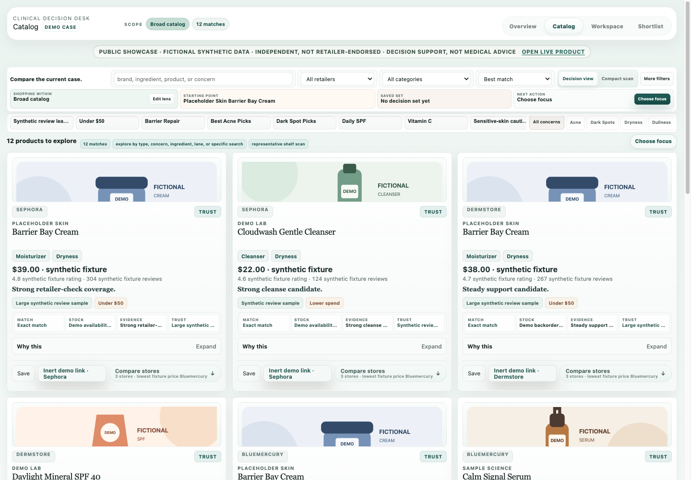

# SkinCare Hub

SkinCare Hub helps shoppers compare skincare products, understand tradeoffs, and build a shortlist and routine. **Aanchal Khandelwal** designed and built the product. This source companion contains a working synthetic browser app and small, runnable engineering examples. Start with the case study, or run an example to inspect failure handling yourself. For offline reading, use the [versioned case study](docs/portfolio/case-study.md).

[**Engineering case study**](https://skincarehub.app/engineering/) · [**Live product**](https://skincarehub.app/) · [**Run the examples**](docs/portfolio/engineering-examples.md)



## What I built and owned

I owned the product flow, application architecture, browser client, Python/SQLite services, catalog normalization, explanation and tool boundaries, evaluation design, and release decisions. Coding assistants supported implementation and documentation; existing runtimes and libraries supplied infrastructure. Ownership means responsibility for those decisions and their verification, not unaided authorship.

The product connects **Catalog → Shortlist → Routine**. The engineering challenge is keeping that decision flow useful when live services are unavailable, context is incomplete, or a provider returns unusable output. Deterministic logic retains eligibility and ranking authority. Generated explanations are optional and cannot override those decisions.

## Three examples to inspect

1. **[Structured explanations](examples/shortlist_ai/shortlist.py).** Resolve selected product IDs, project bounded facts, apply shared guardrails, then validate response fields and citation identifiers. Recognized guarded questions retain cautions and select no product and skip provider execution. Timeouts, refusals, missing context, and invalid output lead to deterministic fallback. A known citation ID does not prove that the prose is supported by its facts; a regression test demonstrates that limit. The ordinary CLI uses mocks; the separate real-provider adapter is disabled by default.
2. **[Bounded MCP tools](examples/mcp/README.md).** A custom Model Context Protocol client starts a local server over standard input/output, discovers three tools, and invokes allowlisted operations over fictional products. This demonstrates actual subprocess communication and bounded dispatch. It does not establish hosted ChatGPT integration or official SDK conformance.
3. **[Offline evaluation](examples/evaluation/README.md).** Pair mock orchestration and deterministic fallback on identical injected scenarios. Inspect contract outcomes and recorded hashes while leaving real-model quality, cost, latency, and human scores explicitly unmeasured.

## Quick start

Clone this repository and run commands from its root. **Python 3.9+ and the standard library** are sufficient for these examples; no credentials or paid calls are needed.

```sh
python3 -B examples/shortlist_ai/shortlist.py --scenario unknown-citation
python3 -B examples/mcp/client.py
python3 -B examples/evaluation/evaluate.py --split all
```

Expect, respectively: JSON with `source: fallback` and `reason: invalid-output`; MCP `status: PASS` with three discovered tools; and 12/12 passing injected contract scenarios. These results test implementation behavior, not recommendation quality. The [canonical reproduction guide](docs/portfolio/engineering-examples.md) contains the full offline checks and is also the download's README.

To explore the synthetic application:

```sh
python3 -m http.server 8000 --bind 127.0.0.1
```

Open [the local catalog](http://127.0.0.1:8000/web/), save products, then inspect Shortlist and Workspace/Routine. Stop with `Ctrl-C`. Browser automation separately requires an installed Chrome/Chromium and loopback permission; see [verification scope](docs/portfolio/evidence.md).

## Architecture and repository boundary

The client is plain HTML, CSS, and native JavaScript modules with no frontend build step. This checkout reads checked-in synthetic fixtures and blocks private API/SSE access. It includes neither the operational backend nor retailer-derived catalogs, imagery, reviews, credentials, or infrastructure.

The private production system adds ingestion, normalization, a Python API, SQLite reads, and server-sent updates. The standalone examples isolate explanation and tool behavior; they do not recreate that backend. See the [architecture and data flow](docs/architecture/overview.md) and [documentation index](docs/README.md). The website is separately deployed; local source changes are not automatically live.

## Research, limitations, and licensing

[ML research](docs/portfolio/responsible-ml.md) supports the product story: predeclared promotion gates failed, so deterministic ranking retained authority. The [synthetic experiment](examples/ml_ranking/README.md) reproduces training, export, and browser parity; its scores measure teacher imitation, not shopper benefit.

SkinCare Hub provides decision support, not medical advice. Keyword guardrails can miss unfamiliar wording. Clinical safety, real-model usefulness, user adoption, human usability, and production reliability are not established by these examples. It is not affiliated with or endorsed by retailers. See the [dated evidence and measurement gaps](docs/portfolio/evidence.md).

The [MIT License](LICENSE) covers original code, documentation, and synthetic assets within the ownership boundaries and third-party exclusions in [NOTICE.md](NOTICE.md).
