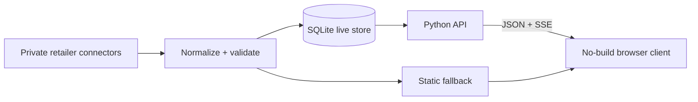

# Data pipeline

The private operational system uses bounded retailer connectors, a shared normalizer, contract validation, SQLite live reads, and a static fallback. Retailer ingestion, production state, and derived catalogs are deliberately absent from this public showcase.

The showcase substitutes 12 fictional products with local project-created SVG illustrations. The fixture keeps the production frontend schema—`id`, `retailer`, `brand`, `name`, `category`, `concerns`, `price`, `description`, `url`, `image`, and `ingredients`—without redistributing retailer content.
