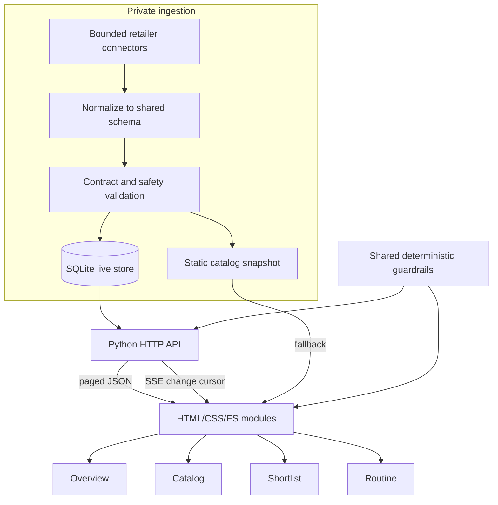

# Current architecture

SkinCare Hub is a static no-build web client with an optional Python/SQLite live-data path in the private deployed system. This public showcase is hard-pinned to same-origin static artifacts: it clears stored API-origin state, performs no API or SSE fallback, and removes a pre-existing controlling service worker before loading the app.

## Responsibilities

| Layer | Responsibility | Representative implementation |
|---|---|---|
| Browser state | Anonymous local state, shell routing, continuity fallback | `web/js/state.js` |
| Catalog | Filter, rank, diversify, and explain a shopper case | `web/js/catalog.js` |
| Decision cards | Evidence, retailer-check, and action presentation | `web/js/cards.js` |
| Shortlist and routine | Approval states, gaps, conflicts, and plan ordering | `web/js/shortlist.js`, `web/js/routine.js` |
| API | Bounded reads, continuity, SSE, and dispatch to four GPT explanation paths | Documented private implementation |
| GPT orchestrator | Context construction, model request, schema/citation validation and deterministic fallback | [Synthetic extraction](../../examples/shortlist_ai/README.md), distinct from private implementation |
| MCP bridge | Protocol discovery/invocation and bounded product-tool dispatch, separate from website UI | [Synthetic transport and original tool inventory](../../examples/mcp/README.md) |
| Store | SQLite normalization and read contracts | Documented private implementation |
| Safety | Shared taxonomy and red-flag/pregnancy/irritation behavior | `scripts/skincare_guardrails.py`, `web/js/guardrails.js` |

## Control and data flow

In the private deployed system, the client first attempts a bounded API snapshot and falls back to the static catalog. API-backed sessions hydrate additional pages after first paint and subscribe to an SSE cursor; updates refresh data in place instead of reloading the shopper’s work. Anonymous continuity is optional and degrades to local browser state. In this public export, the static-safety preflight runs before application bootstrap and the catalog loads only from the checked-in same-origin fixture.

The deterministic ranker owns visible ordering. The default-off ML comparison does not change product order.

## GPT explanation flow and failure handling

The API's Shortlist, embedded comparison, routine and Learn wrappers delegate to a shared orchestration module. Context is assembled from bounded product and shopper inputs, and sensitive questions pass deterministic safety handling. Where enabled, the provider generates a structured explanation. Validation checks shape and allowed citation identifiers before the client presents the result; missing context, refusal, timeout, provider errors and malformed output must lead to a bounded fallback rather than an invented successful answer.

The inspected API default is `gpt-5-mini`, with separate configurable surface model names. This is configuration evidence, not an observation of the model used by a current live response. Schema validity and known citation IDs do not establish factual support for prose. The public static site's safety preflight does not enable provider execution.

## MCP is an integration boundary

An MCP client negotiates protocol capabilities, discovers tools and submits a named invocation with arguments. The bridge validates and dispatches those arguments to product logic, then returns structured tool results for the client to consume. The website does not become an MCP client merely because it shares product concepts with those tools. GPT explanation orchestration is a separate path; deterministic product tools need not invoke a provider.

Read-only annotations describe intent, not access enforcement. Enforced tool and field allowlists, input bounds, source selection and sanitized errors must be inspected and tested. Retrieved content cannot grant additional permissions. Local interoperability, hosted transport behavior, actual ChatGPT invocation and directory approval are distinct evidence levels; none is implied by the others.

## Public/private responsibilities

The published static checkout loads only its fictional same-origin catalog and shared guardrails. Its browser code cannot depend on private credentials, infrastructure or retailer data. Synthetic GPT and MCP examples are separate local programs, not extensions that silently reconnect the public website to production. Provider-backed measurements and external-client connections remain separately opt-in and subject to approval.

Private deployment and ingestion implementation is intentionally excluded from this public allowlist.
