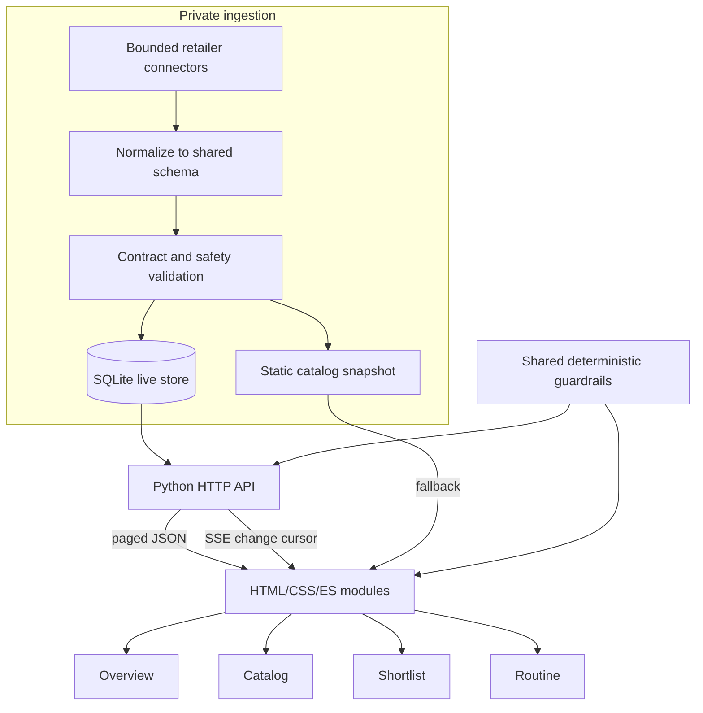

# Current architecture

SkinCare Hub is a static no-build web client with an optional Python/SQLite live-data path in the private deployed system. This public showcase is hard-pinned to same-origin static artifacts: it clears stored API-origin state, performs no API or SSE fallback, and removes a pre-existing controlling service worker before loading the app.

## Responsibilities

| Layer | Responsibility | Representative implementation |
|---|---|---|
| Browser state | Anonymous local state, shell routing, continuity fallback | `web/js/state.js` |
| Catalog | Filter, rank, diversify, and explain a shopper case | `web/js/catalog.js` |
| Decision cards | Evidence, retailer-check, and action presentation | `web/js/cards.js` |
| Shortlist and routine | Approval states, gaps, conflicts, and plan ordering | `web/js/shortlist.js`, `web/js/routine.js` |
| API | Bounded reads, continuity, SSE, and deterministic AI fallback | Documented private implementation |
| Store | SQLite normalization and read contracts | Documented private implementation |
| Safety | Shared taxonomy and red-flag/pregnancy/irritation behavior | `scripts/skincare_guardrails.py`, `web/js/guardrails.js` |

## Control and data flow

In the private deployed system, the client first attempts a bounded API snapshot and falls back to the static catalog. API-backed sessions hydrate additional pages after first paint and subscribe to an SSE cursor; updates refresh data in place instead of reloading the shopper’s work. Anonymous continuity is optional and degrades to local browser state. In this public export, the static-safety preflight runs before application bootstrap and the catalog loads only from the checked-in same-origin fixture.

The deterministic ranker owns visible ordering. Grounded-AI responses are schema-validated and have deterministic fallbacks. The default-off ML comparison does not change product order.

Private deployment and ingestion implementation is intentionally excluded from this public allowlist.
