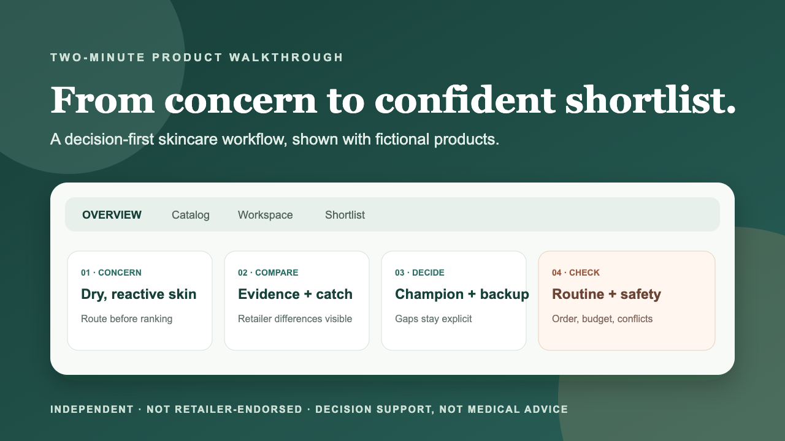
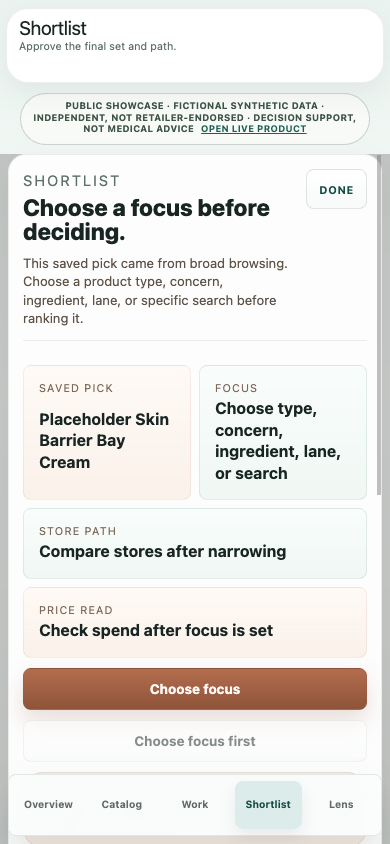

# Product walkthrough and three-minute AI replay

[Watch or download the captioned AI replay](../assets/ai-engineering-replay.webm) · [Inspect the captured commands and complete output](../assets/ai-engineering-capture.json)

The 180-second silent replay shows captured offline executions: mocked GPT explanation and citation rejection, a real local MCP exchange, timeout/guardrail behavior, and synthetic ML comparison. It is not a live GPT session or a screen recording of the deployed website. The separate product flow is below.

| Time | Replay chapter |
|---|---|
| 0:00–0:18 | Product, ownership and GPT/MCP/ML responsibilities |
| 0:18–0:43 | Fictional Shortlist context and resolved product IDs |
| 0:43–1:05 | Explanation and injected unknown-citation rejection into fallback |
| 1:05–1:35 | Real local MCP discovery, search, detail, comparison and errors |
| 1:35–2:00 | Injected timeout and shared safety short-circuit |
| 2:00–2:25 | Synthetic teacher-imitation artifacts and bounded reorder |
| 2:25–2:45 | Separate historical 95-pair study and failed promotion gates |
| 2:45–3:00 | Reproduction paths and evidence limitations |

The capture log binds the source snapshot used when recording; its older manifest hash is provenance, not the manifest of this subsequently packaged checkout. Eight complete command outputs are retained. Pacing is editorial, not measured model latency. The first changed-order frozen ML case is selected for illustration; full-set metrics remain teacher-imitation evidence. No retailer media, credentials, private catalog, or real provider response appears in the replay.

The normal live product is [skincarehub.app](https://skincarehub.app/). The standalone showcase and both current browser captures use only fictional synthetic products; no production-retailer catalog or media is included.

1. **Overview:** choose a concern, budget, ingredient lens, or retailer to establish the case.
2. **Catalog:** confirm the active case, scan the lead and alternatives, and expand `Why this` for evidence and caveats.
3. **Shortlist:** save a candidate, assign champion/backup/hold/cut status, and review gaps or conflicts.
4. **Routine:** build a bounded AM/PM plan and check cost, ordering, and active-heavy combinations.
5. **Evidence:** return to the repository and inspect the architecture or the ML no-promotion decision.

Expected outcome: a reviewer can explain what the product does, what Aanchal owned, and one consequential engineering choice in under 45 seconds.

The private repository preserves the detailed historical walkthrough; it is excluded from this public allowlist.

## Reproduce the AI engineering walkthrough

The product flow above is separate from the local synthetic AI example. From the public checkout, run `python3 examples/shortlist_ai/shortlist.py` to inspect a mocked structured explanation and its supplied product citations. Run it again with `--scenario timeout` to see deterministic fallback. These are offline program executions, not GPT recordings or model-quality evidence.

Run `python3 examples/mcp/client.py` for an actual local MCP search→detail→comparison exchange. Its Example Lab products are a separate fictional fixture from the Shortlist pair; the purpose is the same bounded decision flow, not cross-fixture product identity.

Run `python3 examples/shortlist_ai/shortlist.py --scenario unknown-citation` to reproduce the validation rejection. Inspect the [five-minute code tour](code-tour.md), [paired evaluation design](../../examples/evaluation/README.md), and [verified live ML filter recipe](responsible-ml.md#try-the-bounded-live-comparison) next. The replay above is encoded and locally checked; continuous-playback usability and unfamiliar-human validation remain unverified. New-version publication remains separately pending.
